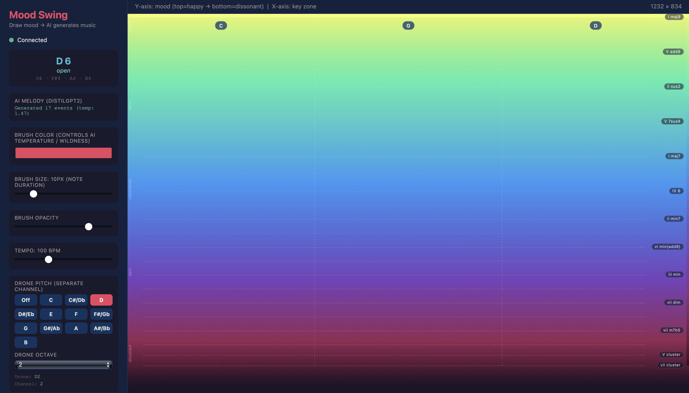

# Mood Swing



Mood Swing is a co-creative tool. Gestures control harmonic mood and a pre-trained DistilGPT2 model generates MIDI phrases in semi-realtime. 

## Creative Purpose

This tool was created for building ideas, improvisation, and harmonic exploration. Use it however you'd like to!

- The canvas acts as a musical controller.
- Gesture position and style shape harmonic mood, density, and phrase energy.
- A transformer model autoregressively generates evolving melody and harmony while you draw.
- Drone and drum layers can run independently for performance-oriented texture.

## What You Control

From the UI:

- `Y-axis` on canvas: harmonic mood/chord region (top = brighter, bottom = darker/dissonant).
- `X-axis` on canvas: key zone (3 vertical tonic segments).
- `Brush color`: model temperature / wildness.
- `Brush size`: note duration scaling.
- `Drawing speed`: melodic velocity.
- `Drawing density`: generation activity and drum intensity.
- `BPM`: global playback tempo.
- `Drone`: pitch buttons + octave, separate MIDI port/channel.
- `Drums`: on/off + groove style (channel 3).
- `Randomize Keys`: reassigns key zones.
- `Chord Overlay`: toggles subtle chord anchor guide lines.
- `Mapping Guide`: toggles mapping help panel.
- `MIDI Panic`: sends note-off for safety.

## System Architecture

### Frontend

- HTML5 canvas + Socket.IO client (`templates/index.html`).
- Sends gesture features to backend.
- Receives status/chord/model/drone/drum updates and renders live UI state.

### Backend

- Flask + Flask-SocketIO app (`app.py`) in `threading` async mode.
- WebSocket endpoints accept drawing/control events and forward to engine.
- `/status` route exposes runtime state.

### Engine

- `MIDIEngine` (`midi_engine.py`) runs 3 concurrent loops.
- `Context loop`: maps X/Y to smoothed chord context.
- `Model loop`: generates ahead into a lookahead queue.
- `Playback loop`: quantized beat-grid playback with monotonic timing.
- Quantized grid (`TICKS_PER_BEAT = 2`) keeps rhythm steady.
- Tempo-adaptive runway keeps enough generated material ahead at faster BPM.
- Underrun fallback phrase avoids silence or hard drops.

### Harmony + Model

- `HarmonicMap` (`harmony.py`) contains dense Y-axis chord anchors.
- `MelodyModel` wraps `DancingIguana/music-generation` (DistilGPT2 via Hugging Face Transformers).
- If model loading fails, the app falls back to chord-tone generation.

## How It Works

At a high level:

`gesture -> mapped chord context -> seed tokens -> autoregressive generation -> post-constraints -> MIDI playback`

Detailed flow:

1. The frontend sends gesture features (`x`, `y`, `speed`, `density`, `hue`, `brush_size`, `is_drawing`) to the backend.
2. The engine maps gesture position to harmonic context:
- `X` selects one of 3 key zones.
- `Y` selects a chord/mood anchor in that key.
3. That mapped chord is used to build **seed tokens**:
- Seed tokens are initial model input tokens (note/chord-tone token strings) that start generation.
- They are built from the chord tones, not from raw UI coordinates directly.
4. The transformer (DistilGPT2 music model) generates autoregressively:
- It predicts next token from prior tokens, repeatedly, starting from the seed.
5. A **post-constraint** pass then enforces harmonic fit:
- Constrains generated notes to allowed pitch classes derived from current chord + mood (`y`).
- Top/bright regions are more consonant/chordal.
- Middle allows broader scale color.
- Bottom/dissonant allows more semitone tension and tritone color.
- Out-of-chord notes are moved to nearest allowed pitch class.
- Allow semitone neighbors + tritone tension when occupying dissonant spaces for added tension and complexity.
6. Quantized playback sends MIDI on a stable beat grid.

Important nuance:

- The UI chord label itself is not directly fed as text to the model.
- Both the UI label and model conditioning come from the same mapped chord context.
- Because generation is queued ahead for continuity, what you hear may briefly reflect recent prior context during rapid movement.

## Model Used

- Model: `DancingIguana/music-generation`
- Family: DistilGPT2 causal language model
- Framework: `transformers` + `torch`
- Generation style: Autoregressive. sampled token generation (`temperature`, `top_k`, `top_p`) with harmonic post-constraining.

## MIDI Routing

The app creates virtual MIDI output ports:

- Melody/Drums port: `Mood Swing Melody Out`
- Drone port: `Mood Swing Drone Out`

Default channels:

- Melody: channel 1
- Drone: channel 2
- Drums: channel 3

Notes:

- Drums are on channel 3 of the melody port.
- Drone is independent on its own port/channel path.

## Setup and Run

1. Create/activate environment.

```bash
uv venv venv -p 3.10
source venv/bin/activate
```

2. Install dependencies.

```bash
uv pip install -r requirements.txt
```

3. Start the app.

```bash
python app.py
```

4. Open the UI at `http://localhost:5001`.

5. Connect MIDI in DAW.
- Use `Mood Swing Melody Out` for melody/drums.
- Use `Mood Swing Drone Out` for drone.
- Filter channels as needed: 1 melody, 2 drone, 3 drums.

## Important Notes

- First model load may be slower and may require internet if weights are not cached locally.
- If the model cannot load, fallback generation still works.
- For best high-BPM stability, keep CPU-heavy background apps minimal.
- If MIDI ports do not appear, restart the app and refresh DAW MIDI device list.
- Use `MIDI Panic` if notes get stuck.

## Quick Troubleshooting

- No chord updates in UI: restart server, reload browser, and confirm status is `Connected`.
- No sound: verify DAW input port + channel and check the UI MIDI status line.
- Drum and melody on same instrument: route channel 3 to a separate drum instrument track.

## License

This project is licensed under the Apache License, Version 2.0. See [LICENSE](LICENSE) for details.
